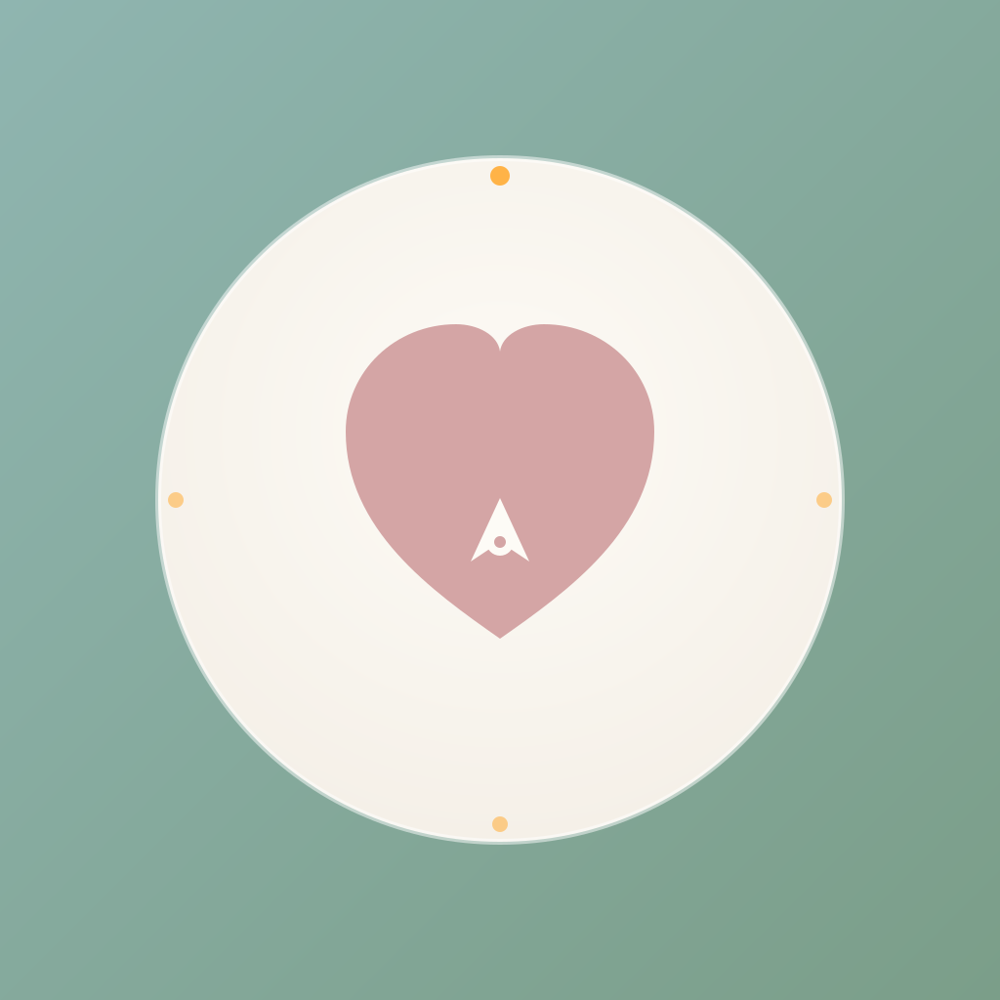

<div align="center">



# こころコンパス｜Kokoro Compass

**A mindfulness wellness app for daily mental care, built with Flutter.**

心の健康をサポートする、毎日のセルフケアアプリ。感謝日記・瞑想・呼吸法・睡眠記録・気分トラッキング機能を1つのアプリに。

[](https://flutter.dev)
[](https://dart.dev)
[]()
[]()

</div>

---

## 概要 / Overview

「こころコンパス」は、忙しい毎日の中で心と向き合う時間を取り戻すためのウェルネスアプリです。複雑な操作や登録は一切なく、今日の気分を1タップで記録するだけで、自分の心の傾向が可視化されます。

すべてのデータは**お使いのデバイス内にのみ保存**され、外部サーバーには送信されません。アカウント登録も不要。安心して心の中を綴ることができます。

> A simple, private wellness companion for daily mental self-care. All data stays on your device — no account, no cloud, no tracking.

---

## 主な機能 / Features

| 機能 / Feature | 説明 / Description |
|---|---|
| 感謝日記 / Gratitude Journal | 今日感謝したことを3つ書き留めるだけで、日常のポジティブな側面に気づく習慣をつくる |
| 気分トラッキング / Mood Tracking | 5段階で気分を記録、グラフで気分の波を可視化 |
| ガイド付き瞑想 / Guided Meditation | 3分・5分・10分の短時間ガイド瞑想 |
| 4-7-8呼吸法 / 4-7-8 Breathing | アニメーションに合わせて呼吸でリラックス |
| 睡眠記録 / Sleep Tracking | 就寝・起床時刻と睡眠の質を記録 |
| 今日の目標 / Daily Goals | 小さな目標を設定し、達成バッジで継続をサポート |
| リラクゼーションサウンド / Ambient Sounds | 雨・波・森など9種類の環境音 |
| ジャーナリング・プロンプト / Journaling Prompts | 心の整理を促す問いかけ集 |
| ムードカレンダー / Mood Calendar | 気分の推移をカレンダーで一覧 |
| インサイト / Insights | 記録データから傾向を抽出 |
| 週間レポート / Weekly Report | 1週間の振り返り |
| 達成バッジ / Achievement Badges | 継続を可視化 |

---

## スクリーンショット / Screenshots

> 公開後にApp Store / Google Playのスクリーンショットを掲載予定
>
> _Screenshots will be added after App Store / Google Play release._

---

## 技術スタック / Tech Stack

### Framework
- **Flutter** (3.x) — Cross-platform mobile framework
- **Dart** (3.x) — Programming language
- **Material Design 3** — UI design system

### State Management & Storage
- **Provider** — Reactive state management
- **shared_preferences** — Local key-value storage
- **DatabaseService** — Local persistence layer

### Architecture
シンプルな MVVM ライクな構成：

```
lib/
├── main.dart                    アプリエントリーポイント
├── models/                      データモデル
│   ├── gratitude_entry.dart
│   ├── happiness_record.dart
│   └── sleep_record.dart
├── providers/                   状態管理（ChangeNotifier）
│   ├── gratitude_provider.dart
│   ├── happiness_provider.dart
│   ├── meditation_provider.dart
│   ├── sleep_provider.dart
│   ├── goals_provider.dart
│   ├── achievement_provider.dart
│   ├── statistics_provider.dart
│   └── theme_provider.dart
├── screens/                     画面（15画面以上）
│   ├── home_screen.dart
│   ├── gratitude_screen.dart
│   ├── happiness_screen.dart
│   ├── meditation_screen.dart
│   ├── breathing_screen.dart
│   ├── sleep_screen.dart
│   ├── goals_screen.dart
│   ├── insights_screen.dart
│   ├── mood_calendar_screen.dart
│   ├── prompts_screen.dart
│   ├── sounds_screen.dart
│   ├── statistics_screen.dart
│   ├── weekly_report_screen.dart
│   ├── achievements_screen.dart
│   └── settings_screen.dart
├── services/                    データサービス層
│   └── database_service.dart
└── widgets/                     再利用可能ウィジェット
    ├── gratitude_entry_widget.dart
    └── quick_mood_widget.dart
```

### CI/CD
- **Codemagic** — Cloud-based CI/CD for Flutter（Mac不要のクラウドビルド）
- **flutter_launcher_icons** — マルチプラットフォーム向けアイコン自動生成

---

## プライバシー / Privacy

- **すべてのデータはローカル保存**：外部サーバーへの送信は一切行いません
- **アカウント登録不要**：起動してすぐ利用可能
- **広告SDK・解析SDK不使用**：第三者にデータが渡ることはありません
- **データのエクスポート・全削除**を設定画面から実行可能

詳細は [プライバシーポリシー](https://galiverman.jp) を参照ください。

---

## 開発環境 / Getting Started

### Prerequisites
- Flutter SDK 3.0+
- Dart SDK 3.0+
- iOS開発: Xcode（macOS必須）
- Android開発: Android Studio + JDK 17+

### Setup

```bash
# 依存関係のインストール
flutter pub get

# アプリアイコンの生成（全サイズ）
dart run flutter_launcher_icons

# 開発実行（接続中のデバイスで）
flutter run

# リリースビルド（Android）
flutter build appbundle --release

# リリースビルド（iOS、要macOS）
flutter build ipa --release
```

### Project Structure
コードベースは画面ごとに provider と screen が対応する形で整理されています。新しい機能を追加する場合は：
1. `models/` にデータモデルを追加
2. `providers/` に対応する Provider を追加
3. `screens/` に画面を追加
4. `services/database_service.dart` にデータ永続化ロジックを追加
5. `home_screen.dart` のグリッドにエントリーを追加

---

## ロードマップ / Roadmap

- [x] 基本機能（感謝日記、瞑想、呼吸法、睡眠、気分）の実装
- [x] iOS / Android 両OS対応
- [x] アプリアイコン・メタデータ整備
- [ ] **App Store 公開**（準備中 / Coming Soon）
- [ ] **Google Play 公開**（準備中 / Coming Soon）
- [ ] HealthKit / Google Fit 連携（将来検討）
- [ ] Apple Watch / Wear OS 拡張（将来検討）
- [ ] iCloud / Google Drive バックアップ（オプション機能として）

---

## ライセンス / License

このリポジトリは個人開発作品として公開しています。コードはポートフォリオ目的での閲覧を想定しており、商用利用・再配布は許諾していません。

This repository is published as a personal portfolio project. The code is shared for review and reference only; commercial use or redistribution is not permitted without prior consent.

---

## 開発者 / Author

**t.o (kinuta)** — Mobile × AI Engineer

エンジニア歴8年、iOS / Android / Flutter のモバイルアプリ開発を主軸に、Claude / Gemini API 連携や業務自動化システムの構築を業務委託で承っています。

8 years of experience in mobile app development. Specialized in Flutter and AI integration with LLM APIs (Claude, Gemini).

- Blog: [galiverman.jp](https://galiverman.jp)
- Lancers: [@onuki_takayuki](https://www.lancers.jp/profile/onuki_takayuki)
- CrowdWorks: [@kinuta](https://crowdworks.jp/public/employees/kinuta)

---

<div align="center">

Made in Tokyo, Japan

</div>
